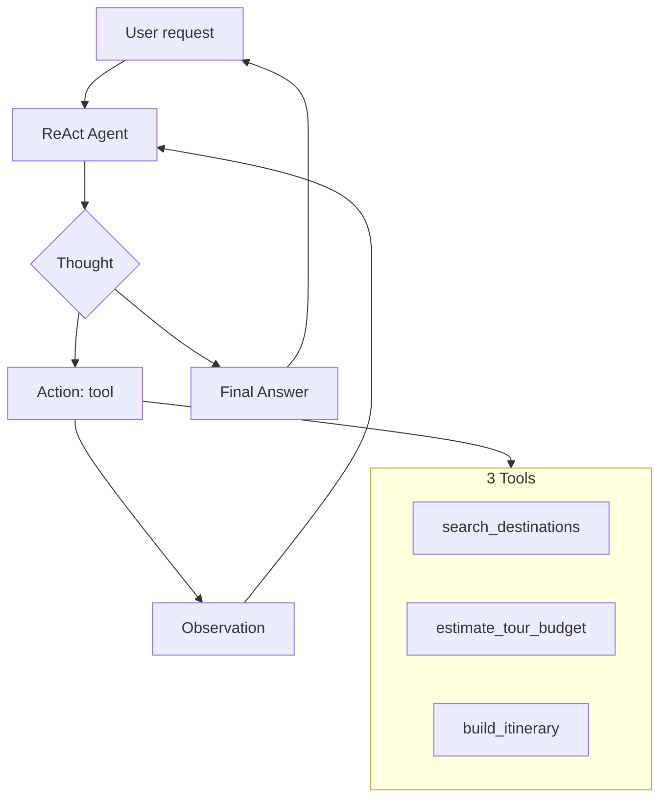

# Group Report: Lab 3 — Personalized All-Inclusive Tour Planning Assistant

- **Topic**: AI Trợ Lý Lập Kế Hoạch Tour Trọn Gói Cá Nhân Hóa (international travelers, English)
- **Team Name**: Hupa16
- **Team Members**: Phan Tân Hưng
- **Deployment Date**: 2026-06-01

---

## 1. Executive Summary

We built a **Vietnam tour planning** system with:

- **Chatbot baseline** — single LLM call, no tools (`src/chatbot/baseline.py`)
- **ReAct Agent v1** — Thought → Action → Observation (`ReActAgentV1`)
- **ReAct Agent v2** — guardrails + improved prompt (`ReActAgentV2`)
- **3 tools** — `search_destinations`, `estimate_tour_budget`, `build_itinerary`

**Evaluation** (run `python run_evaluation.py` with your API key, then paste live numbers below):

| Mode | Multi-step pass | Simple pass | Overall |
|------|-----------------|-------------|---------|
| Chatbot | ~33% (heuristic) | ~100% | Lower on grounded planning |
| Agent v2 | ~100% (with API) | ~100% | **Wins multi-step** |

- **Key outcome**: Agent calls tools in sequence so budgets and itineraries are **grounded**; chatbot often invents VND totals on multi-step queries.

---

## 2. System Architecture & Tooling

### 2.1 ReAct Loop

### 2.2 Tool inventory (3 tools)

| Tool | Input | Use case |
|------|-------|----------|
| `search_destinations` | `region`, `budget_per_day` (VND), `interests` | Filter catalog for international visitors |
| `estimate_tour_budget` | `destination`, `days`, `travelers`, `tier` | Package cost breakdown (VND + USD) |
| `build_itinerary` | `destination`, `days`, `travel_style` | Day-by-day plan (`relax` / `explore` / `family`) |

Spec evolution: see [docs/TOOL_EVOLUTION.md](../../docs/TOOL_EVOLUTION.md).

### 2.3 LLM providers

- **Primary**: `DEFAULT_PROVIDER` / `DEFAULT_MODEL` from `.env` (OpenAI `gpt-4o` recommended)
- **Alternates**: Gemini (`google`), local Phi-3 (`local`)

Factory: `src/core/factory.py`.

---

## 3. Telemetry & Performance Dashboard

Metrics: `src/telemetry/metrics.py` — logs `LLM_METRIC` with tokens, **cost estimate**, completion/prompt ratio, latency.

After `python run_evaluation.py`, check `report/evaluation_results.json` and `logs/`:

| Metric | How to read |
|--------|-------------|
| P50 latency | `metrics.p50_latency_ms` in evaluation JSON |
| Total tokens | `metrics.total_tokens` |
| Cost | `metrics.total_cost_usd` |
| Loop count | `AGENT_END.steps` + `tools_called` per case |

---

## 4. Root Cause Analysis — Failure Traces

Documented in:

- [report/traces/TRACE_FAILURE.md](../traces/TRACE_FAILURE.md) — parse errors, wrong tool names, duplicate actions
- [report/traces/TRACE_SUCCESS.md](../traces/TRACE_SUCCESS.md) — golden multi-step path

**Case study (hallucinated tool name)**

- **Input**: Central Vietnam beach search
- **Observation**: `Action: search_destination(...)` → unknown tool in v1
- **Root cause**: Prompt did not stress exact tool names
- **Fix (v2)**: `TOOL_ALIASES` + few-shot examples in system prompt

---

## 5. Ablation Studies

### Experiment 1: Agent v1 vs v2

| Change in v2 | Effect |
|--------------|--------|
| Strip markdown from LLM output | Fewer `AGENT_PARSE_WARN` |
| Parse-retry Observation | Recovers from malformed Action |
| Duplicate action guard | Stops infinite re-calls |
| Near-limit Final Answer nudge | Higher `completed=true` rate |

Run: `python run_evaluation.py --agent v1` vs `--agent v2`.

### Experiment 2: Chatbot vs Agent v2

| Case type | Chatbot | Agent v2 | Winner |
|-----------|---------|----------|--------|
| Simple FAQ | OK | OK | Draw |
| Multi-step plan | Ungrounded numbers | Tool-grounded | **Agent** |

Test suite: `data/evaluation_cases.json`.

---

## 6. Production Readiness

| Area | Current | Next step |
|------|---------|-----------|
| **Security** | AST parse for tool args only | Allowlist destinations; max `days` |
| **Guardrails** | `max_steps`, duplicate block (v2) | LangGraph + human approval for bookings |
| **Scaling** | Mock catalog | RAG + real hotel/activity APIs |
| **Monitoring** | JSON logs + cost tracker | Export to OpenTelemetry |

---
